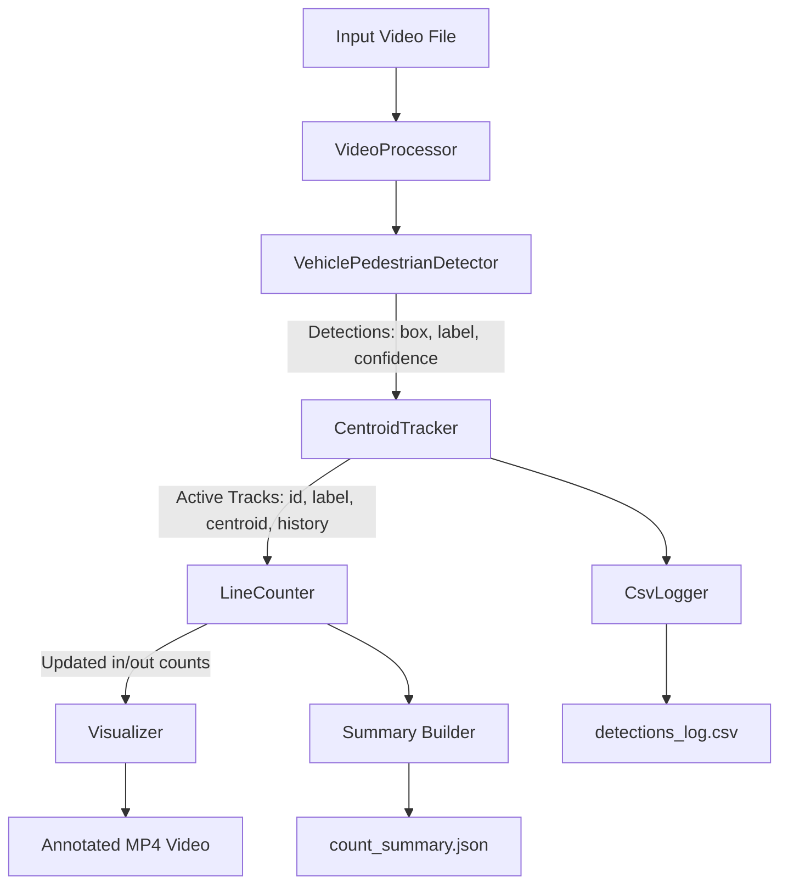
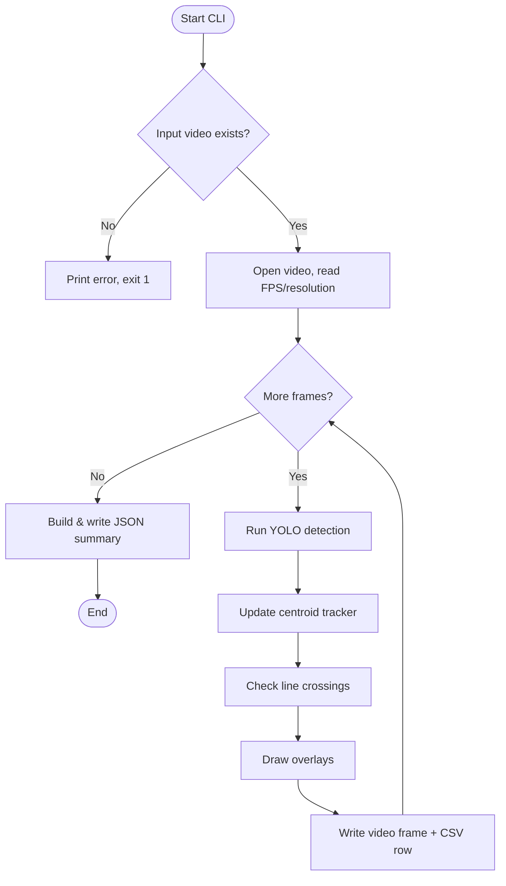
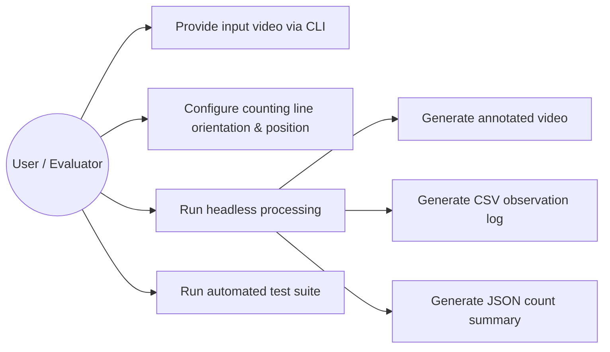
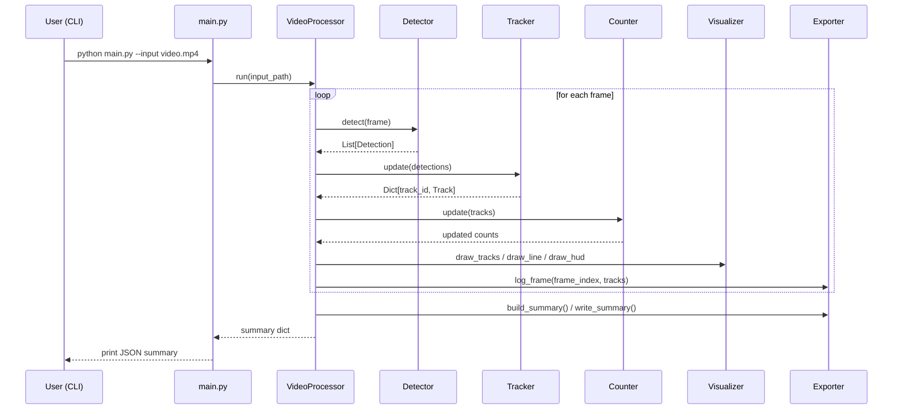
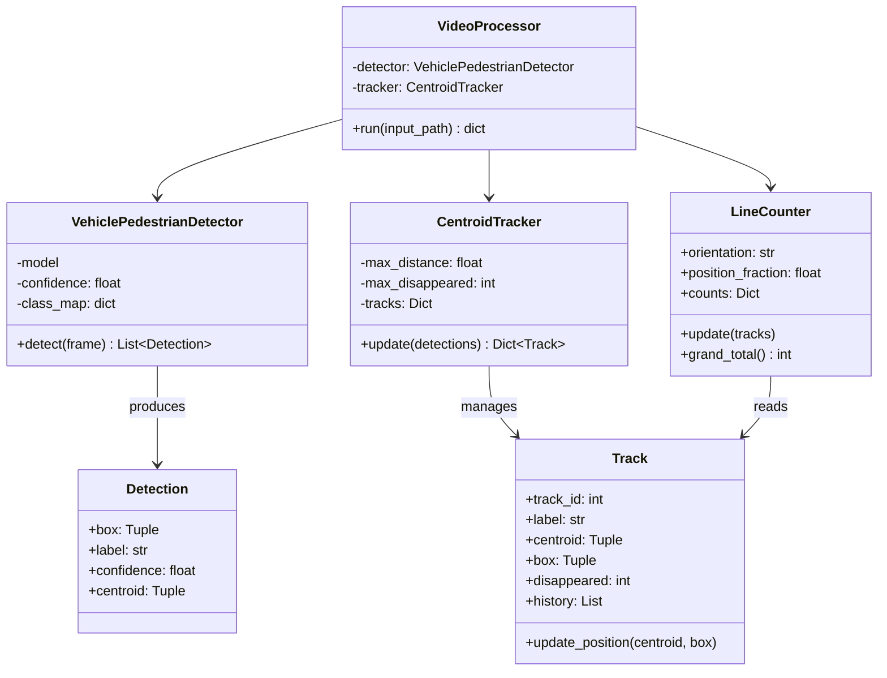

# System Architecture & Design

## 1. Architecture Overview

The pipeline is split into independent, single-responsibility modules.
Each stage only depends on the data structures produced by the stage
before it, which keeps every module independently testable.



## 2. Component Responsibilities

| Module | File | Responsibility |
|---|---|---|
| `VehiclePedestrianDetector` | `src/detector.py` | Wraps YOLO; filters to relevant classes; returns `Detection` objects |
| `CentroidTracker` | `src/tracker.py` | Associates detections across frames into persistent `Track` objects |
| `LineCounter` | `src/counter.py` | Detects line crossings per track and tallies directional counts by class |
| `Visualizer` | `src/visualizer.py` | Draws boxes, IDs, trails, the line, and the HUD panel |
| `CsvLogger` / `exporter.py` | `src/exporter.py` | Writes per-frame CSV rows and the final JSON summary |
| `VideoProcessor` | `src/video_processor.py` | Orchestrates the frame loop, wiring all modules together |
| `main.py` | `main.py` | CLI argument parsing and headless entry point |

## 3. Process Flow / Workflow Diagram



## 4. Use Case Diagram



## 5. Sequence Diagram



## 6. Class / Component Diagram



## 7. Output Schemas

### `detections_log.csv`

| Column | Type | Description |
|---|---|---|
| frame | int | Zero-indexed frame number |
| track_id | int | Persistent tracker ID |
| label | str | Object class (`car`, `pedestrian`, etc.) |
| x, y | int | Top-left corner of bounding box |
| width, height | int | Bounding box dimensions |

### `count_summary.json`

```json
{
  "frames_processed": 300,
  "total_crossings": 42,
  "crossings_by_class": {
    "car": {"in": 20, "out": 15, "total": 35},
    "pedestrian": {"in": 4, "out": 3, "total": 7}
  },
  "line_orientation": "horizontal",
  "line_position_fraction": 0.5,
  "input_resolution": "1280x720",
  "video_fps": 25.0,
  "processing_seconds": 18.4,
  "output_video": "outputs/annotated_video.mp4",
  "csv_log": "outputs/detections_log.csv"
}
```

## 8. Error Handling & Robustness

- Missing input file → prints a clear stderr message and exits with code `1`
  instead of raising an unhandled traceback.
- Unreadable/corrupt video → `VideoProcessor.run` raises a `RuntimeError`
  that `main.py` catches and reports cleanly.
- No GUI dependency by default (`--show` is opt-in only), and
  `QT_QPA_PLATFORM=offscreen` is set before any OpenCV window code can run,
  so the pipeline works on headless grading servers.
