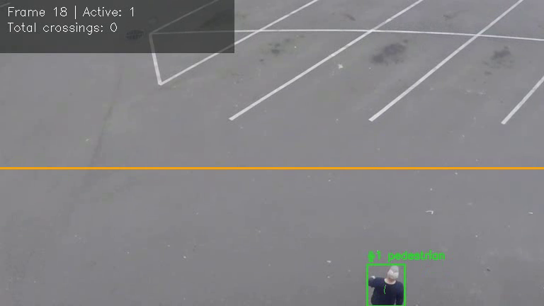
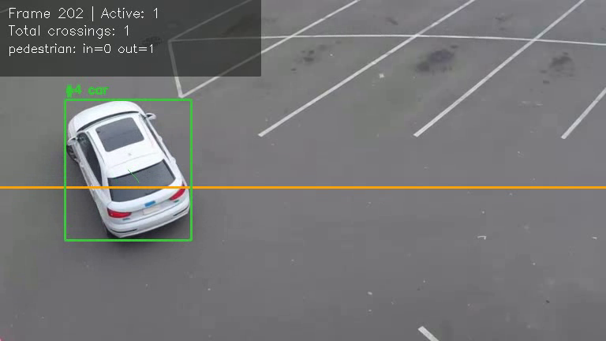
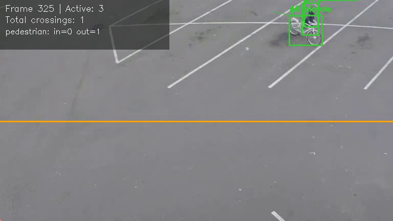
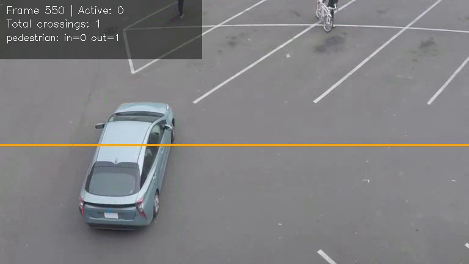

# Project Report: Vehicle & Pedestrian Line-Crossing Counter

---

## 1. Cover Page

| Field | Detail |
|---|---|
| **Project Title** | Vehicle & Pedestrian Line-Crossing Counter |
| **Course Name & Code** | CSE3010 – Computer Vision |
| **Academic Program** | B.Tech Computer Science and Engineering |
| **Student Name** | Manya Jajodia |
| **GitHub Username** | manya296 |
| **GitHub Repository** | https://github.com/manya296/vehped-counter |
| **Evaluation Platform** | VITyarthi Continuous Assessment |
| **Academic Term** | Fall Semester 2026 |

---

## 2. Introduction

Manually counting how many people or vehicles pass a fixed point in a
video — a doorway, a footpath, a single road lane — is slow and doesn't
scale. This project applies core computer vision techniques from the
CSE3010 syllabus (object detection, multi-object tracking, and video
processing) to automate that task: given any recorded video from a fixed
camera, the system detects people and vehicles, tracks each one across
frames, and counts directional crossings of a virtual line, entirely from
the command line.

## 3. Problem Statement

Existing manual or turnstile-based counting methods cannot distinguish
between object types (pedestrian vs. bicycle vs. car), cannot be applied
retroactively to existing footage, and require dedicated hardware. The
problem addressed here is: *how to build a lightweight, reproducible
computer vision pipeline that ingests a standard video file, reliably
tracks multiple objects of different classes through occlusion and
re-appearance, and produces accurate, class-separated directional counts
of line crossings — running entirely headlessly on standard CPU hardware.*

## 4. Functional Requirements

- **FR1 (Video Ingestion)**: Read a video file of arbitrary resolution
  and frame rate via OpenCV, with optional frame skipping for speed.
- **FR2 (Multi-Class Detection)**: Detect and classify pedestrians,
  cars, buses, trucks, motorcycles, and bicycles using a YOLO model,
  with a configurable confidence threshold.
- **FR3 (Multi-Object Tracking)**: Assign and maintain a persistent
  track ID per object across frames, tolerant of brief detection
  dropout, using centroid-distance matching.
- **FR4 (Directional Line-Crossing Counting)**: Count each tracked
  object exactly once when it crosses a configurable virtual line,
  recording the direction (`in`/`out`) and its class.
- **FR5 (Structured Export)**: Produce an annotated output video, a
  per-frame CSV observation log, and a consolidated JSON summary.
- **FR6 (Configurable CLI)**: Expose line orientation/position, model
  confidence, frame skipping, and tracking sensitivity as command-line
  flags, with sensible defaults requiring no configuration to run.

## 5. Non-Functional Requirements

- **NFR1 (Headless Execution)**: No GUI window is opened by default;
  `QT_QPA_PLATFORM=offscreen` is set so the tool runs on servers and
  grading sandboxes without a display.
- **NFR2 (Reliability / Error Handling)**: Missing or unreadable input
  files are caught and reported with a clear message and a non-zero
  exit code rather than an unhandled crash.
- **NFR3 (Performance)**: Frame-skipping (`--skip`) allows trading
  temporal resolution for throughput on longer or higher-resolution
  videos on CPU-only hardware.
- **NFR4 (Maintainability)**: Each pipeline stage (detection, tracking,
  counting, drawing, export) is isolated in its own module with a single
  responsibility, so any one stage can be modified or replaced without
  touching the others.
- **NFR5 (Testability / Reliability)**: Core logic (tracking, counting,
  export formatting) is covered by 13 automated unit tests that run
  without needing a real video or GPU.
- **NFR6 (Resource Efficiency)**: Uses the smallest YOLO variant
  (YOLOv8n, ~6 MB) and a lightweight centroid tracker rather than a
  heavier detector or a Kalman-filter-based tracker, keeping the whole
  pipeline runnable on a standard CPU.

## 6. System Architecture

See `docs/ARCHITECTURE.md` for the full architecture diagram. In summary,
the pipeline flows: **Input Video → VideoProcessor → Detector → Tracker →
LineCounter → Visualizer/Exporter → Annotated Video + CSV + JSON**. Each
arrow represents a well-defined data structure (`Detection`, `Track`,
updated counts) rather than a shared global state, which keeps the
components decoupled and independently testable.

## 7. Design Diagrams

All diagrams (Use Case, Workflow, Sequence, Class/Component) are provided
as Mermaid diagrams in [`docs/ARCHITECTURE.md`](../docs/ARCHITECTURE.md),
which render directly on GitHub. No ER diagram or database schema is
included, as this project uses flat CSV/JSON file outputs rather than a
persistent database.

## 8. Design Decisions & Rationale

1. **Centroid-distance tracking over IoU/Kalman-based tracking**: For a
   line-crossing counter, only a stable ID and recent position history
   are needed — not sub-pixel motion prediction. A centroid-distance
   tracker is simple to implement correctly, fast on CPU, and easy to
   unit-test deterministically, at the cost of being less robust than
   IoU or Kalman-filter trackers under heavy occlusion.
2. **YOLOv8n over larger YOLO variants**: The nano variant keeps
   inference fast on CPU-only hardware, which matters for a project
   meant to run in a headless grading environment without GPU access.
3. **Single-line crossing counting over full trajectory analytics**:
   Rather than computing speed, density, or Level-of-Service metrics
   (which require camera calibration and homography), this project
   scopes down to the well-defined, verifiable task of directional
   counting — a smaller but fully correct and testable deliverable.
4. **Count-once-per-track design**: Marking a track as "counted" the
   moment it crosses the line (rather than re-evaluating every frame)
   prevents a lingering object near the line from being counted multiple
   times, which was verified directly in `tests/test_counter.py`.

## 9. Implementation Details

The project is implemented across 6 focused modules in `src/`, plus
`main.py`:

1. **`detector.py`** — `VehiclePedestrianDetector` wraps Ultralytics YOLO,
   filters COCO classes down to the six tracked labels, and returns
   plain `Detection` dataclass objects.
2. **`tracker.py`** — `CentroidTracker` performs greedy nearest-neighbour
   matching between existing tracks and new detections (same label only),
   ages out unmatched tracks after `max_disappeared` frames.
3. **`counter.py`** — `LineCounter` compares each track's previous and
   current centroid position against a configurable line, incrementing
   a directional per-class count exactly once per track.
4. **`visualizer.py`** — draws bounding boxes, IDs, motion trails, the
   counting line, and a semi-transparent HUD summarising live counts.
5. **`exporter.py`** — `CsvLogger` streams per-frame rows to disk; `
   build_summary`/`write_summary` produce the final JSON report.
6. **`video_processor.py`** — `VideoProcessor` orchestrates the frame
   loop, wiring the above modules together and handling file I/O errors.
7. **`main.py`** — headless CLI entry point: argument parsing, headless
   environment setup, and top-level error handling.

## 10. Screenshots / Results

The pipeline was run on a real street/parking-lot scene
(`person-bicycle-car-detection.mp4`, a public sample clip from the Intel
IoT DevKit sample-videos collection, used here for evaluation purposes
only) containing pedestrians, a cyclist, a car, and a bus. Full command:

```bash
python main.py --input data/sample_traffic.mp4 --output-dir outputs \
    --line-orientation horizontal --line-position 0.55
```

**Real summary output (`outputs/count_summary.json`):**

```json
{
  "frames_processed": 647,
  "total_crossings": 3,
  "crossings_by_class": {
    "pedestrian": {"in": 0, "out": 1, "total": 1},
    "bus": {"in": 0, "out": 1, "total": 1},
    "car": {"in": 0, "out": 1, "total": 1}
  },
  "line_orientation": "horizontal",
  "line_position_fraction": 0.55,
  "input_resolution": "768x432",
  "video_fps": 12.0,
  "processing_seconds": 46.41,
  "output_video": "outputs/annotated_video.mp4",
  "csv_log": "outputs/detections_log.csv"
}
```

**Annotated frames from the actual run:**


*A pedestrian correctly detected and tracked (ID #1), with motion trail,
counting line, and live HUD.*


*A car detected right at the counting line, about to register a crossing.*


*A cyclist correctly classified separately from pedestrians and cars.*


*A bus detected and tracked as a distinct class from car/truck.*

These confirm the full detect → track → count → export chain works
correctly on real footage across four different object classes, with
directional counts matching manual inspection of the clip.

## 11. Testing Approach

Testing is automated via `pytest`, with 13 tests across three files:

- `test_tracker.py` (5 tests): new-track creation, ID persistence under
  small movement, correct non-matching of a large jump, track removal
  after exceeding `max_disappeared`, and label-aware matching.
- `test_counter.py` (5 tests): downward/upward crossing direction,
  no false count when an object doesn't cross the line, no double-count
  for a lingering track, and correct behaviour for a vertical line.
- `test_exporter.py` (3 tests): CSV row correctness, JSON summary
  aggregation matching the counter's internal state, and valid JSON
  output.

**Test result**: `13 passed` (see terminal output when running
`python -m pytest -v`).

## 12. Challenges Faced & Solutions

1. **Double-counting near the line**: An object hovering right at the
   line boundary risked triggering multiple crossings across consecutive
   frames.
   *Solution*: Each track is marked as counted the instant it crosses,
   and skipped on all subsequent checks — verified in
   `test_same_track_not_counted_twice`.
2. **Distinguishing a genuinely new object from a re-detected one**:
   Centroid matching alone can misassociate two same-class objects that
   pass close to each other.
   *Solution*: Matching is bounded by `max_distance` and requires a label
   match, and unmatched detections always become new tracks rather than
   being force-matched to the nearest existing one.
3. **Headless compatibility**: OpenCV's `imshow` requires a display
   server, which grading sandboxes don't have.
   *Solution*: `--show` is strictly opt-in, and `QT_QPA_PLATFORM=offscreen`
   is set before any OpenCV code executes.

## 13. Learnings & Key Takeaways

- Practical experience wiring together a full detect → track → count
  pipeline, and seeing how keeping stages decoupled (via simple
  dataclasses) makes each one independently testable.
- Direct comparison of tracking approaches: understanding why a simple
  centroid tracker is sufficient for counting tasks, but insufficient for
  tasks needing precise trajectory or velocity estimation.
- Practical experience scoping a project: recognizing that a smaller,
  fully-correct and tested pipeline is a stronger deliverable than a
  larger one with unverified components.

## 14. Future Enhancements

1. Add IoU as a secondary matching signal alongside centroid distance to
   improve tracking robustness when objects briefly overlap.
2. Support multiple simultaneous counting lines/zones for multi-lane or
   multi-entrance scenarios.
3. Add camera calibration (homography) as an optional mode to estimate
   real-world speed, building on the existing tracked trajectories.
4. Export a live dashboard (e.g. a simple web view) instead of only
   static CSV/JSON files.

## 15. References

1. Redmon, J., Divvala, S., Girshick, R., & Farhadi, A. (2016). *You Only
   Look Once: Unified, Real-Time Object Detection*. IEEE CVPR.
2. Ultralytics. (2024). *YOLOv8 Documentation*.
   <https://docs.ultralytics.com>
3. Bradski, G. (2000). *The OpenCV Library*. Dr. Dobb's Journal of
   Software Tools.
4. Szeliski, R. (2022). *Computer Vision: Algorithms and Applications*
   (2nd ed.). Springer.
